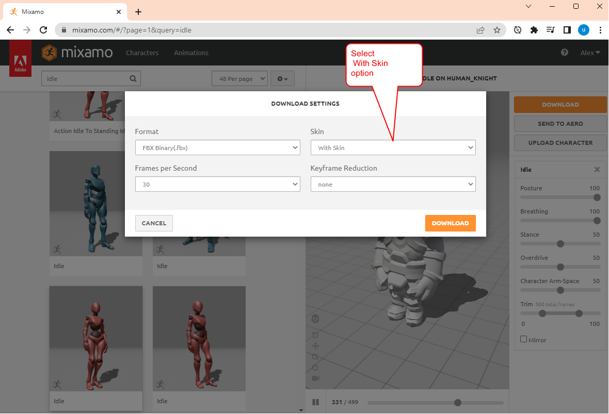

# hands-cubes

## Task -- Prepare headset (if required)
1. Enable hands tracking in `Hands and Controllers` settings
2. Open `chrome://flags/` page and enable experimental feature `WebXR experiences with hand and joints tracking` for browser

## Task -- Play animation with console
1. Download asset with animation from:
- [https://sketchfab.com/feed]()
- [https://www.cgtrader.com]()
- [https://www.turbosquid.com]()
- [https://free3d.com]()

2. Check model with Open model in [Google Model Viewer](https://modelviewer.dev/editor/)

2. Add animation with Mixamo
- Open Mixamo web site: [https://www.mixamo.com]()
- Upload your character `human_knight.fbx`
- Chose several animations: Idle, Walk, Dance, Dying
- Save character model with animations

NOTE: When dowload animation check without skin option

3. 
